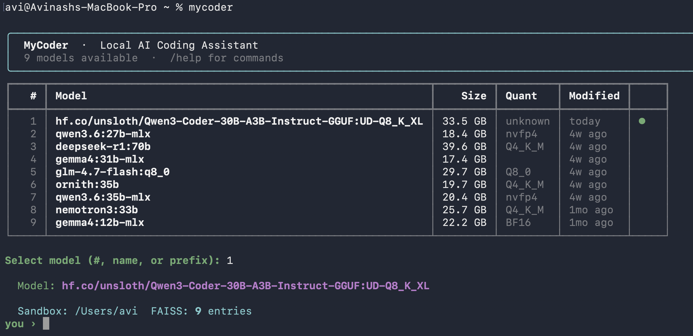
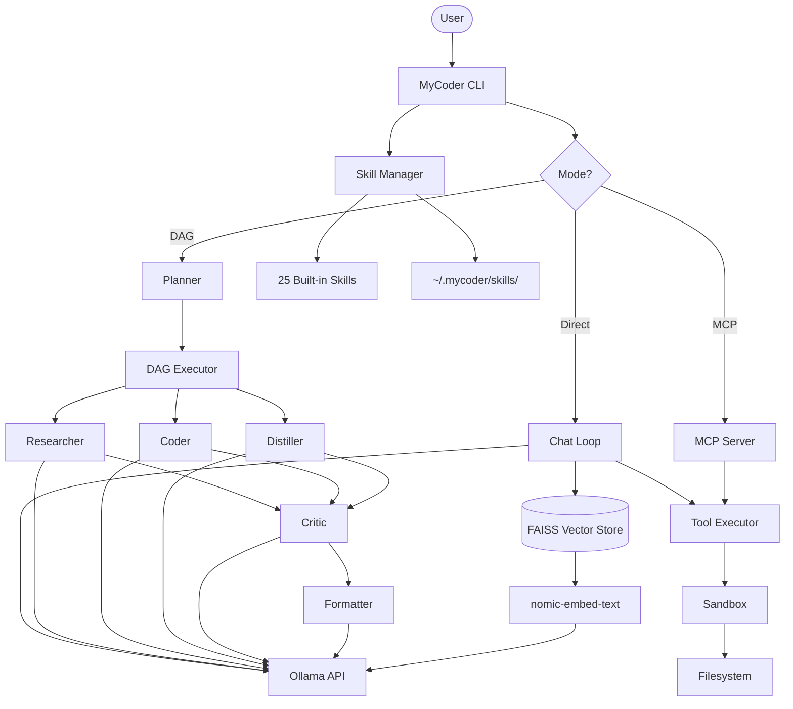
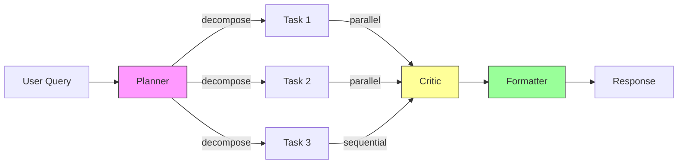

# MyCoder

Local AI coding assistant powered by Ollama — like Claude Code, but with your own models.

## Features

- **Multi-model support** — auto-discovers all Ollama models on startup
- **Tool calling** — read/write/edit files, run commands, search codebases
- **Thinking tokens** — renders thinking from DeepSeek R1, Qwen 3.6, and similar models
- **Skills system** — 25 built-in skills + custom user skills
- **FAISS vector store** — stores all queries/results as embeddings for semantic retrieval
- **DAG orchestrator** — multi-agent task decomposition with parallel execution
- **Sandboxing** — all file operations confined to a root directory
- **MCP server** — expose tools via Model Context Protocol for external integrations
- **Graphify** — dependency graph analysis of any repository
- **Streaming metrics** — tokens/sec, context size, latency

## Screenshot



## Architecture



## DAG Flow



## Installation

### Quick install

```bash
./install.sh
```

### Manual install

```bash
# Create venv and install
uv venv .venv
source .venv/bin/activate
uv pip install -e .

# Or with pip
python3 -m venv .venv
source .venv/bin/activate
pip install -e .
```

### Requirements

- Python 3.10+
- [Ollama](https://ollama.com) running locally
- At least one Ollama model pulled
- `nomic-embed-text` model for FAISS (optional but recommended)

```bash
ollama pull nomic-embed-text
```

## Usage

### Interactive mode

```bash
mycoder                    # start interactive session
mycoder -m qwen3.6         # start with specific model
mycoder -d /path/to/code   # set sandbox root
mycoder --ctx 16384        # set context window
```

### One-shot mode

```bash
mycoder run "explain this error" -y
mycoder run "add tests for auth.py"
```

### MCP server mode

```bash
mycoder mcp    # stdin/stdout JSON-RPC
```

### List models

```bash
mycoder models
```

## Commands

| Command | Description |
|---------|-------------|
| `/help` | Show all commands and skills |
| `/models` | List models or switch (`/model <name>`) |
| `/skills` | List all loaded skills |
| `/reload` | Hot-reload skills from disk |
| `/metrics` | Session statistics |
| `/clear` | Clear conversation history |
| `/cd <path>` | Change working directory |
| `/dag` | Toggle DAG orchestration mode |
| `/search <q>` | Search past queries (FAISS) |
| `/mcp-log` | Show tracked MCP calls |
| `/exit` | Quit |

## Modules

### Sandbox (`mycoder/sandbox.py`)

All file operations are confined to a sandbox root directory. Path traversal and symlink escapes are blocked. Shell commands are validated against a blocklist. External access is only permitted through tracked MCP calls.

### Vector Store (`mycoder/vector_store.py`)

FAISS IndexFlatIP with L2-normalized vectors for cosine similarity. Embeds query/result pairs using `nomic-embed-text` via Ollama's `/api/embed` endpoint. Persists index and metadata to `~/.mycoder/vector_store/`.

### DAG Orchestrator (`mycoder/dag/`)

Multi-agent task decomposition inspired by [multi-agent-dag-orchestrator](https://github.com/AvinashAnad/multi-agent-dag-orchestrator).

| Module | Purpose |
|--------|---------|
| `schemas.py` | Data models — NodeSpec, AgentResult, DAGPlan |
| `graph.py` | NetworkX DiGraph wrapper with ready-node detection |
| `executor.py` | Async parallel execution of DAG nodes |
| `planner.py` | LLM-based query decomposition into sub-tasks |
| `recovery.py` | Failure classification (transient/validation/upstream) and retry/skip/fail strategies |

**Roles**: Planner, Researcher, Coder, Distiller, Critic, Formatter

### MCP Server (`mycoder/mcp/server.py`)

JSON-RPC server (stdin/stdout) implementing the Model Context Protocol. Exposes all MyCoder tools with `mycoder_` prefix. All calls are tracked through the sandbox MCP log.

### Skills (`mycoder/skills.py`)

Markdown files with YAML frontmatter. Two types:
- **always** — injected into every system prompt
- **prompt** — activated via `/skillname`

Skills load from:
1. `mycoder/builtins/*.md` (shipped)
2. `~/.mycoder/skills/*.md` (user custom, overrides built-ins)

### Tools (`mycoder/tools.py`)

Seven built-in tools: `read_file`, `write_file`, `edit_file`, `run_command`, `search_files`, `list_directory`, `find_files`. Write/edit/run require user confirmation. All paths resolved through sandbox.

## Skills Reference

### Always-on skills
| Skill | Path | Description |
|-------|------|-------------|
| `codestyle` | `mycoder/builtins/codestyle.md` | Enforces clean, consistent code style |
| `karpathy` | `mycoder/builtins/karpathy.md` | Andrej Karpathy's coding principles |
| `overconfidence` | `mycoder/builtins/overconfidence.md` | Guards against overconfident assertions |

### Invocable skills (`/skillname`)
| Skill | Path | Description |
|-------|------|-------------|
| `/autoresearch` | `mycoder/builtins/autoresearch.md` | Autonomous research loop (Karpathy's autoresearch) |
| `/caveman` | `mycoder/builtins/caveman.md` | Simplify explanations radically |
| `/claude-md` | `mycoder/builtins/claude-md.md` | Manage CLAUDE.md project files |
| `/context-mgmt` | `mycoder/builtins/context-mgmt.md` | Context window management |
| `/debug` | `mycoder/builtins/debug.md` | Systematic debugging approach |
| `/dumb-down` | `mycoder/builtins/dumb-down.md` | ELI5 explanations |
| `/explain` | `mycoder/builtins/explain.md` | Deep code explanations |
| `/feature-dev` | `mycoder/builtins/feature-dev.md` | Feature development workflow |
| `/frontend-design` | `mycoder/builtins/frontend-design.md` | Frontend design patterns |
| `/fullstack` | `mycoder/builtins/fullstack.md` | Full-stack development |
| `/git` | `mycoder/builtins/git.md` | Git workflow and best practices |
| `/github-ops` | `mycoder/builtins/github-ops.md` | GitHub operations |
| `/graphify` | `mycoder/builtins/graphify.md` | Repository dependency graph analysis |
| `/playwright` | `mycoder/builtins/playwright.md` | Playwright testing |
| `/ralph-loop` | `mycoder/builtins/ralph-loop.md` | Iterative refinement loop |
| `/refactor` | `mycoder/builtins/refactor.md` | Code refactoring patterns |
| `/review` | `mycoder/builtins/review.md` | Code review checklist |
| `/security-guidance` | `mycoder/builtins/security-guidance.md` | Security best practices |
| `/simplify` | `mycoder/builtins/simplify.md` | Code simplification |
| `/skill-creator` | `mycoder/builtins/skill-creator.md` | Create new skills |
| `/superpowers` | `mycoder/builtins/superpowers.md` | Advanced coding patterns |
| `/test` | `mycoder/builtins/test.md` | Testing strategies |
| `/typescript-lsp` | `mycoder/builtins/typescript-lsp.md` | TypeScript LSP integration |

## Testing

```bash
# Run all tests
pytest mycoder/tests/ -v

# Run specific test module
pytest mycoder/tests/test_sandbox.py -v
pytest mycoder/tests/test_dag.py -v

# With coverage
pytest mycoder/tests/ --cov=mycoder --cov-report=term-missing
```

## Project Structure

```
MyCoder/
├── pyproject.toml
├── install.sh
├── README.md
└── mycoder/
    ├── __init__.py
    ├── __main__.py
    ├── app.py              # Main CLI — REPL, commands, chat loop
    ├── client.py            # Ollama HTTP client with streaming
    ├── tools.py             # File/shell tools (sandboxed)
    ├── skills.py            # Skill loader (builtins + user)
    ├── ui.py                # Terminal UI with Rich
    ├── sandbox.py           # Path jailing + MCP tracking
    ├── vector_store.py      # FAISS + nomic-embed-text embeddings
    ├── dag/
    │   ├── __init__.py
    │   ├── schemas.py       # Data models
    │   ├── graph.py         # NetworkX DAG
    │   ├── executor.py      # Async parallel executor
    │   ├── planner.py       # Query decomposition
    │   └── recovery.py      # Failure handling
    ├── mcp/
    │   ├── __init__.py
    │   └── server.py        # MCP JSON-RPC server
    ├── builtins/            # 25 built-in skills
    │   ├── codestyle.md
    │   ├── graphify.md
    │   └── ...
    └── tests/
        ├── test_sandbox.py
        ├── test_tools.py
        ├── test_vector.py
        ├── test_dag.py
        └── test_mcp.py
```

## Configuration

MyCoder uses `~/.mycoder/` for user data:

```
~/.mycoder/
├── skills/           # Custom skill .md files
└── vector_store/     # FAISS index + metadata
    ├── index.faiss
    └── entries.json
```

## Supported Models

MyCoder auto-discovers all Ollama models. Tested with:

| Model | Notes |
|-------|-------|
| `qwen3.6:27b-mlx` | Thinking tokens supported |
| `deepseek-r1:70b` | Thinking tokens supported |
| `gemma4:31b-mlx` | Fast general reasoning |
| `nemotron3:33b` | Strong coding |
| `ornith:35b` | Multi-purpose |
| `nomic-embed-text` | Used for FAISS embeddings |

## License

MIT
